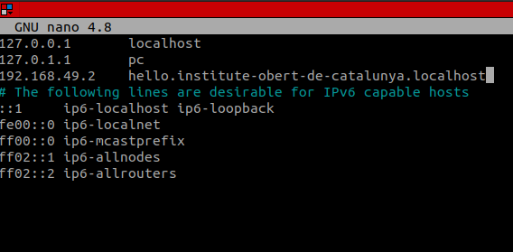

## Step-1: Deploy Deployment

Deploy a Deployment with Image `hashicorp/http-echo:0.2.1`.
For that create a yaml file with below config with any name say `deploy.yaml`.

```yaml
apiVersion: apps/v1
kind: Deployment
metadata:
  name: http-echo
  labels:
    app: http-echo
spec:
  replicas: 3
  selector:
    matchLabels:
      app: http-echo
  template:
    metadata:
      labels:
        app: http-echo
    spec:
      containers:
      - name: http-echo
        image: hashicorp/http-echo:0.2.1
        args:
        - -text="hello-world" 
        ports:
        - containerPort: 5678

```

Now apply the avobe file using kubectl.

```bash
kubectl apply -f deploy.yaml
```

To check the deployment:
```bash
~/project $ kubectl get deploy
NAME        READY   UP-TO-DATE   AVAILABLE   AGE
http-echo   3/3     3            3           4m43s
```


## Step-2: Deploy Service

Now create a service for the above deployment.

Create a yaml file with below config for the service let's say `service.yaml`.

```yaml
apiVersion: v1
kind: Service
metadata:
  name: http-echo-service
spec:
  selector:
    app: http-echo
  ports:
    - protocol: TCP
      port: 8080
      targetPort: 5678
```

now apply the above yaml with kubectl.

```bash
kubectl apply -f service.yaml
```

To check the created service:
```bash
~/project $ kubectl get service
NAME                TYPE        CLUSTER-IP       EXTERNAL-IP   PORT(S)    AGE
http-echo-service   ClusterIP   10.111.144.245   <none>        8080/TCP   2m3s
kubernetes          ClusterIP   10.96.0.1        <none>        443/TCP    7m35s
```

## Step-3: Create Ingress

- Enable ingress controller

```bash
minikube addons enable ingress
```
Note: It may take some time.

- Create Ingress resource with below config `ingress.yaml`

```yaml
apiVersion: networking.k8s.io/v1
kind: Ingress
metadata:
  name: http-echo-ingress
spec:
  rules:
  - host: "hello.institute-obert-de-catalunya.localhost"
    http:
      paths:
      - pathType: Prefix
        path: "/"
        backend:
          service:
            name: http-echo-service
            port:
              number: 8080
```

Create the ingress resource using kubectl.

```bash
kubectl apply -f ingress.yaml
```

Check crated ingress resource:

```bash
kubectl get ingress
```
You'll find something like this.

```bash
NAME                CLASS   HOSTS                                          ADDRESS        PORTS   AGE
http-echo-ingress   nginx   hello.institute-obert-de-catalunya.localhost   192.168.49.2   80      5m58s
```

Your Address may be different. Now you have add Host name in `/etc/hosts` to access the host using curl.

For that add address and host name like this.

```bash
sudo nano /etc/hosts
```



Now curl time.

```bash
~ $ curl hello.institute-obert-de-catalunya.localhost
"hello-world"
```


## Step-4: Update version to 0.2.3

Update the service from 0.2.1 to 0.2.3.
To do this open the `deploy.yaml` file and then update the image tag to 0.2.3.

```yaml
apiVersion: apps/v1
kind: Deployment
metadata:
  name: http-echo
  labels:
    app: http-echo
spec:
  replicas: 3
  selector:
    matchLabels:
      app: http-echo
  template:
    metadata:
      labels:
        app: http-echo
    spec:
      containers:
      - name: http-echo
        image: hashicorp/http-echo:0.2.3
        args:
        - -text="hello-world" 
        ports:
        - containerPort: 5678
```

Now apply it using kubectl.

```bash
kubectl apply -f deploy.yaml
```
- Deployment is successfully updated with image 0.2.3